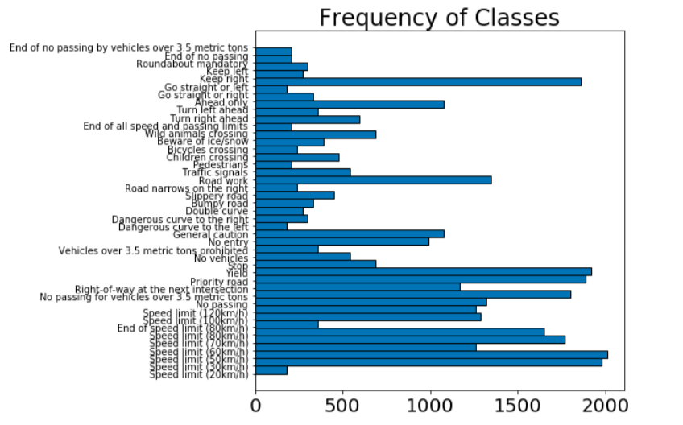

# Traffic Sign Recognition

### Goals
- Load dataset
- Explore, summarize and visualize the data set
- Design, train and test a model architecture
- Use the model to make predicition on new images
- Analyze the softmax probabilities of the new images
- Summarize the results with a written report


## Data Set Summary 
I used the pandas library to calculate summary statistic of the traffic signs data set:
- The size of training set is: 34799
- The size of the validation set is: 4410
- The size of test set is: 12630
- The shape of a traffic sign image is: (32, 32, 3) 
- The number of unique/labels in the data set: 43 

## Exploratory visualization of the dataset.
- There are 43 different road signs in this dataset, so let's visulaize them


- And in the above dataset we have different frequency for each class and some classes are less sampled as compared to other, so will have difficulties in prediciting them correctly by our model.




## Design and Test a Model Architecture

### 1. Preprocessing
1. Change the image from RGB TO HSL with help of `img = cv2.cvtColor(img, cv2.COLOR_RGB2HSL)`
2. After that only took the 1 channel as the preprocessed output. `img = img[:,:,1]`
3. Then convert the pixels as float32 and substract 255 for each pixel and divide it by 255 to make it in a range of $[-1,1]$. `img =(img.astype(np.float32)-255)/255`. This is how I have normalized the image dataset.

Here is an example of a traffic sign image befor and after preprocessing is done.


### 2. Model Architecture
| Layer         		|     Description	        					| 
|:---------------------:|:---------------------------------------------:| 
| Input         		| 32x32x1 Normalized Image and preprocessed   							| 
| Convolution 5x5 (conv1) Input: Input    	| 1x1 stride, valid padding, outputs 28x28x6 	|
| MaxPooling 2x2 (conv10) Input: conv1   	| 1x1 stride, same padding, outputs 28x28x6 	|
| MaxPooling 5x5 (conv11) Input: conv10   	| 1x1 stride, same padding, outputs 28x28x6 	|
| Residual Block (res_block0) Input: (conv1,conv10,conv11)   	| tf.concat(\[conv1,conv10,conv11\],axis = 3) outputs 28x28x18 	|
| Batch Normalization (conv1) Input: res_block0					|												momentum=0.99, epsilon=0.001|
| RELU			(conv1)		|				Activation						|
| MaxPooling 5x5	(conv1)      	| 2x2 stride, valid padding outputs 14x14x18 				|
| Convolution 5x5 (conv2) Input: conv1    	| 1x1 stride, valid padding, outputs 10x10x36 	|
| MaxPooling 2x2 (conv20) Input: conv2   	| 1x1 stride, same padding, outputs 10x10x36	|
| MaxPooling 5x5 (conv21) Input: conv20  	| 1x1 stride, same padding, outputs 10x10x36 	|
| Residual Block (res_block1) Input: (conv2,conv20,conv21)   	| tf.concat(\[conv2,conv20,conv21\],axis = 3) outputs 10x10x108 	|
| Batch Normalization (conv2) Input: res_block1					|												momentum=0.99, epsilon=0.001|
| RELU			(conv2)		|				Activation						|
| MaxPooling 5X5	(conv2)      	| 2x2 stride, valid padding outputs 5x5x108 				|
| Flatten	(flatten)      	| 		outputs (batch_size,2700)		|
| Fully connected	(fc1)	| Input:(batch_size,2700) Output:       (batch_size,216)			|
| RELU	(fc1)	|Activation		|
| Fully connected	(fc2)	| Input:(batch_size,216) Output:       (batch_size,84)			|
| RELU	(fc2)	|Activation		|
| DROPOUT	(fc2)	|Regularization keep_prob=0.5		|
| Fully connected	(out)	| Input:(batch_size,84) Output:       (batch_size,n_classes)			|
| Softmax	(out)	|Activation		|

### Model Training description
-  Hyperparameter
```
## HYPER PARAMETER
learning_rate = 0.001
n_batches = 256
epochs = 100
```
- The optimizer used in this implementation is Adam Optimizer.
- After training for 100 epochs he validation accuracy was 92%
- After this I fine tunned the weights with a smaller learning rate.
- And the hyperparameter were as follows
```
learning_rate = 0.00001
n_batches = 512
epochs = 10
```
- After doing finetunning the accuracy were as follows:
    1. Train Accuracy: 0.9979
    2. Validation Accuracy: 0.9718
    3. Test Accuracy: 0.946
    
- The above architecture was inspired by Resnet architecture,
- This was my first model and it worked pretty well.

### Confusion Matrix


- When we analyze this Confusion matrix we see our model does fantastic job with most of the traffic sign and does not do that well on some classes.
- The classes on which it didn't do well are:
    1. Roundabout mandatory with 0.54 accuracy
    2. Pedstrian with 0.7 accuracy
    3. Slippery Road with 0.73 accuracy
    4. Bicycle Crossing with 0.83 accuracy
    
### Test a Model on New Image
1. Choose five German traffic signs found on the web and provide them in the report.
2. As we have seen our model does not do well with Roundabout Mandatory road Sign so I have included that too see how my model perform on that.
3. The title of each image is the predicted label


4. So out of 6 images my model predicted 5 of them correctly. And one was incorrectly classified and Roundabout sign was misclassiified.
5. So accuracy of our model on these images are 83.33%

### Let's take an example


- It's not classifying the image correctly, output prediction should be 'Roundabout mandatory'.
- So, in the above picture its quite clear there are multiple building in the background unlike our dataset.
- Image taken is at different angle if we compare it with our training dataset. We could overcome this by introducing image augmentation in our training dataset.
- And it's contrast and brightness is different as compared to the training dataset, but we overcome that with image pre-processing.
- And if we look at our confusion matrix too our model is not doing great at classifying "Roundabout mandatory" road sign.

## Visualizing the Neural Network.
#### Visualizing the Residual block 1.


#### Visualizing the Residual block 2.


### Future work
- I think to improve the model performance I can work on image augmentation and hope the performance improves.
- Secondly some classes are under sampled and we can collect more images of them.
- And at last we could use transfer learning and utilize the pretrained weights from network like Resnet34 and etc.